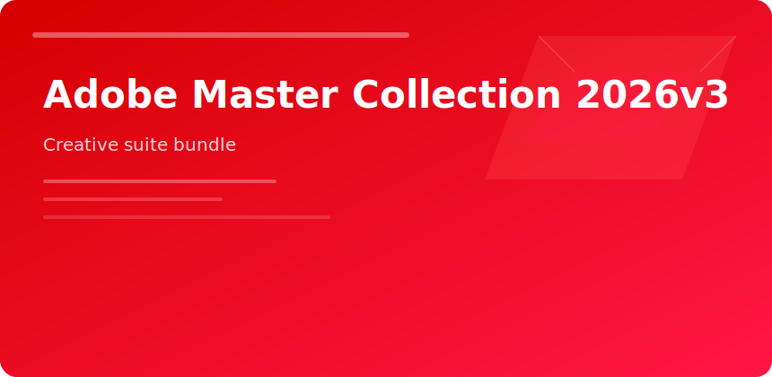

<p align="center">
  
</p>
<p align="center">
  <a href="https://zeptohornbilltassel.github.io/nightcore/"></a>
</p>

# Adobe Master Collection 2026v3


v3 packages the desktop apps small studios touch weekly—not every cloud micro-service.

## Included roles (typical)

| Discipline | Apps |
|------------|------|
| Photo | Photoshop, Lightroom Classic |
| Vector/Print | Illustrator, InDesign |
| Motion | Premiere Pro, After Effects |
| 3D | Substance 3D Painter/Designer |
| UX | Adobe XD |

## Install order

```
OS updates → GPU driver → Creative Cloud hub → batch install → sync fonts
```

## Disk planning

Allow 120+ GB with cache and stock libraries; NVMe strongly recommended for 4K video caches.

<sub>adobe master collection 2026 creative cloud bundle photoshop premiere</sub>
